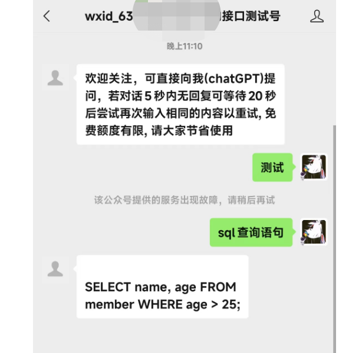

# chatGpt（公众号接入）

## 介绍
为你的公众号接入最近火爆的AI -- chatGPT


## 安装教程

1.  安装依赖 npm i
2.  启动npm run start

## 使用说明
```sh
#  修改项目中的 config.js 中的公众号配置

    'appID': '',
    'appsecret': '',
    'token': ''
    
#  修改项目中的 openai.js 中的GPT的key

    headers: {
                "Content-Type": "application/json",
                "Authorization": "Bearer 你的key值你的key值" 
            }
#   APIKEY获取
https://platform.openai.com/account/api-keys

````


项目成功运行之后，由于微信配置需要80/443端口，大家在部署的时候请自行修改运行端口或者通过映射到80/443端口即可
使用公众号测试号进行测试。


测试成功运行如下图
故障说明：由于回答超时，大家可以自行在代码中自定。



## 接入个人微信版
请移步到此仓库：https://gitee.com/lmuiotctf/chatGpt_wechat

## 网页版体验
http://chat.wxredcover.cn/

### 欢迎大家start!!!!!!

### 添加微信（备注: wechabot）进群交流

**如果二维码图片没显示出来，请添加微信号 留言**

